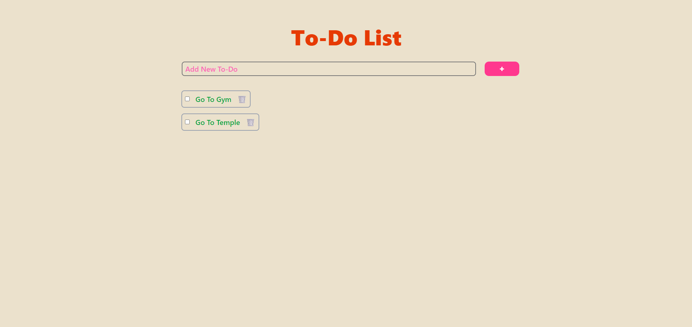

# ✅ Simple Todo App

A minimal yet functional Todo List application built using **Angular** and styled with **Tailwind CSS**. Add, check, delete, and manage your daily tasks effortlessly with a clean UI.

## 🛠️ Tech Stack

- [Angular](https://angular.io/) (v16+)
- [Tailwind CSS](https://tailwindcss.com/) (v3+)
- TypeScript
- HTML5

---

## 🚀 Features

- ✅ Add new todos
- 🔄 Toggle completed (checked/unchecked)
- ❌ Delete todos
- 📋 Dynamic list rendering with Angular's `*ngFor`
- 🎨 Tailwind CSS for modern, responsive design
- 📥 Local state management (in-memory)

---

## 📦 Installation

### Clone the repository
```bash
git clone https://github.com/your-username/angular-todo-app.git
cd todo-list
```

### Install dependencies
```bash
npm install
```

### Run Locally
```bash
ng serve
```
Then open your browser at: http://localhost:4200

## 📸 Screenshots



## ✨ Contributing
Pull requests are welcome. For major changes, please open an issue first to discuss the proposed changes.

## 📄 License
MIT License © Shivam Gupta